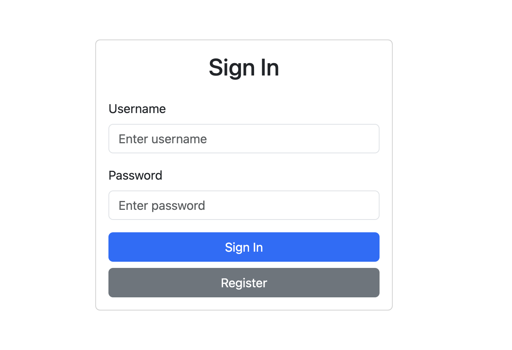
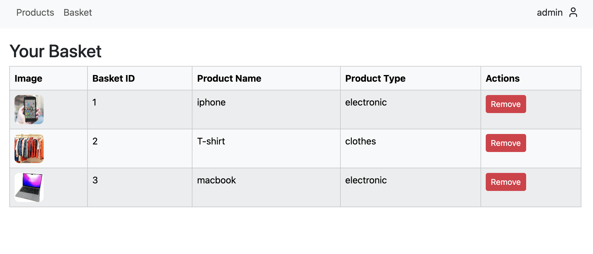
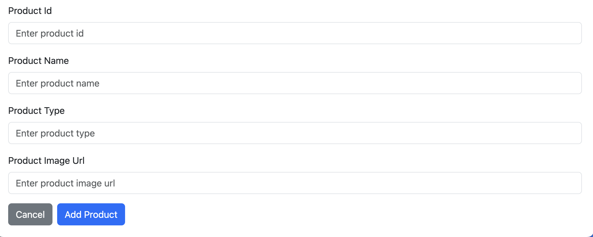

# Simple Commerce App

    

## Available Scripts

In the project directory, you can run:

### `npm start`

**! It will run the react in local  !**

### `docker-compose up -d --build`

**! It will run the react in docker container  !**

## Screens from App

### Login Page

### Product Page

### Basket Page

### Add Product Page

